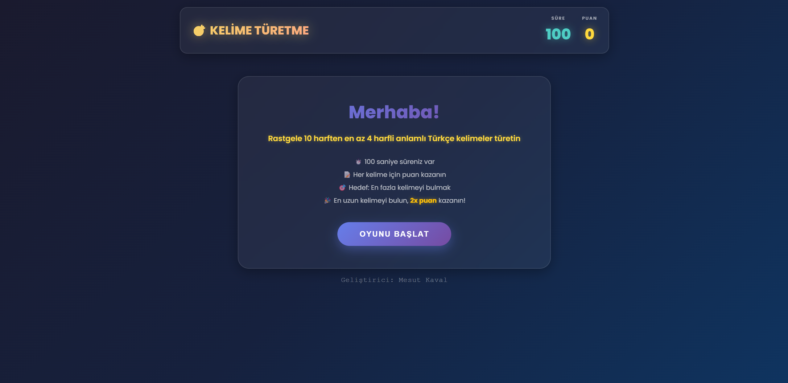
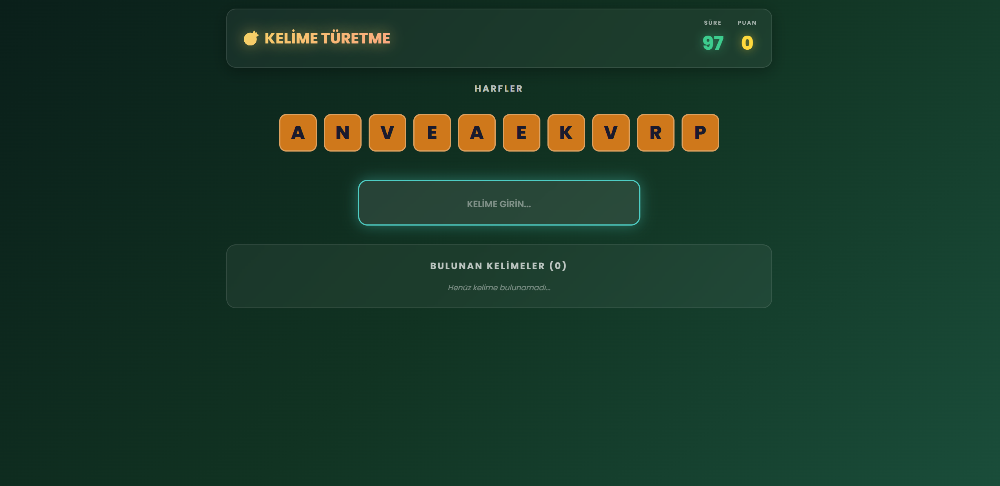
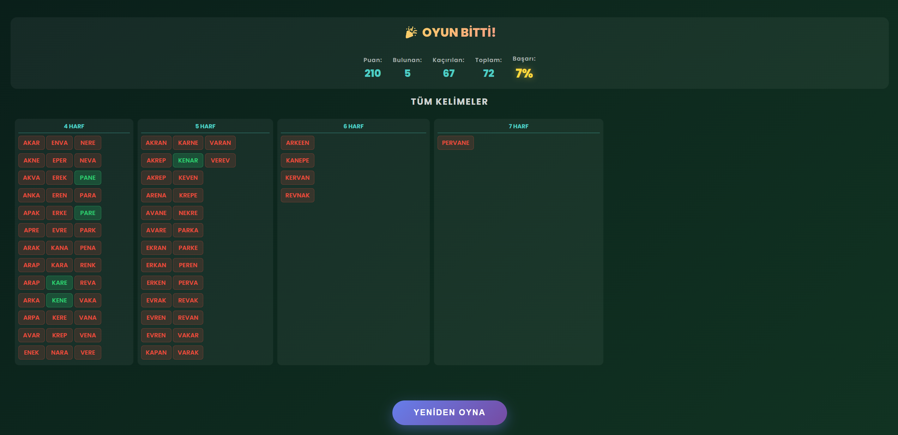

# 🎮 Kelime Türetme Oyunu

Türkçe kelime bulma oyunu - Verilen harflerden en fazla kelimeyi bulun!

## 🌐 Canlı Demo

**[🎮 Oyunu Github Pages Üzerinden Oyna!](https://MesutKaval.github.io/super_bulmaca/)**

> Oyunu tarayıcınızda hemen deneyebilirsiniz - kurulum gerektirmez!

## 📖 Oyun Hakkında

Kelime Türetme Oyunu, 10 rastgele harften oluşan bir setten en fazla geçerli Türkçe kelimeyi bulmanızı gerektiren eğlenceli ve eğitici bir kelime oyunudur. 100 saniye içinde kelime dağarcığınızı test edin ve en yüksek puanı elde edin!

> **Not:** Bu oyun, popüler "Süper Bulmaca" programından esinlenerek geliştirilmiştir. Oyun, Antigravity aracılığıyla Claude Sonnet 4.5 yapay zeka modeli kullanılarak oluşturulmuştur.

## 📸 Ekran Görüntüleri

### Başlangıç Ekranı


### Oyun Ekranı


### Sonuç Ekranı


## 🎯 Nasıl Oynanır?

### Başlangıç
1. **"OYUNU BAŞLAT"** butonuna tıklayın
2. Ekranda 10 rastgele harf görünecek (4 sesli, 6 sessiz harf)
3. 100 saniyelik geri sayım başlayacak

### Kelime Bulma
1. Verilen harfleri kullanarak **en az 4 harfli** geçerli Türkçe kelimeler oluşturun
2. Kelimenizi giriş kutusuna yazın
3. **Enter** tuşuna basarak kelimeyi gönderin
4. Doğru kelimeler yeşil renkte "Bulunan Kelimeler" bölümünde görünecek

### Puanlama Sistemi
- **Normal Kelime:** Harf sayısı × 10 puan
  - Örnek: 5 harfli kelime = 50 puan
- **🎉 BONUS - En Uzun Kelime:** Harf sayısı × 10 × 2 = **2x Puan!**
  - Oyundaki en uzun kelimeyi bulduğunuzda alkış sesi duyarsınız
  - Örnek: 7 harfli en uzun kelime = 140 puan

### Kurallar
- ✅ Her harf, kelimede bulunduğu kadar kullanılabilir
- ✅ Minimum 4 harf gerekli
- ✅ Sadece Türkçe sözlükteki kelimeler geçerli
- ✅ Aynı kelime birden fazla kez gönderilemez
- ❌ Eksik veya fazla harf kullanamazsınız

## 🎨 Özellikler

### Oyun Mekanikleri
- 🎲 **Akıllı Harf Seçimi:** Türkçe harf frekanslarına göre dengeli harf dağılımı
- ⏱️ **100 Saniye:** Heyecan verici geri sayım
- 🔊 **Ses Efektleri:** 
  - Doğru kelime sesi
  - Yanlış kelime sesi
  - Son 10 saniye uyarı sesi
  - En uzun kelime alkış sesi (cheering.wav)
- 💯 **Gerçek Zamanlı Puanlama:** Anlık puan güncellemesi

### Görsel Özellikler
- 🌈 Modern gradient tasarım
- ✨ Animasyonlu geçişler
- 📱 Responsive tasarım
- 🎯 Kullanıcı dostu arayüz
- 🔤 Otomatik büyük harf gösterimi

### Oyun Sonu Özeti
Oyun bittiğinde detaylı bir özet ekranı görürsünüz:

#### İstatistikler
- 🎉 **Toplam Puan:** Kazandığınız puan
- ✅ **Bulunan:** Bulduğunuz kelime sayısı
- ❌ **Kaçırılan:** Kaçırdığınız kelime sayısı
- 📊 **Başarı Oranı:** Yüzdelik başarı oranınız

#### Kelime Listesi
- Tüm geçerli kelimeler harf sayısına göre sütunlarda gösterilir
- **Yeşil:** Bulduğunuz kelimeler
- **Kırmızı:** Kaçırdığınız kelimeler
- Alfabetik sıralama ile kolay inceleme

## 🚀 Kurulum ve Çalıştırma

### Gereksinimler
- Python 3.x (yerel sunucu için)
- Modern web tarayıcısı (Chrome, Firefox, Edge, Safari)

### Hızlı Başlangıç

#### Windows Kullanıcıları
1. `sunucu_baslat.bat` dosyasına çift tıklayın
2. Tarayıcı otomatik olarak açılacak
3. Oyunun keyfini çıkarın! 🎮

#### Manuel Başlatma
```bash
# Proje dizinine gidin
cd super_bulmaca

# Python HTTP sunucusunu başlatın
python -m http.server 8000

# Tarayıcınızda açın
# http://localhost:8000
```

## 📁 Proje Yapısı

```
super_bulmaca/
├── index.html                    # Ana HTML dosyası
├── style.css                     # Stil dosyası
├── script.js                     # Oyun mantığı
├── turkce_kelime_listesi.txt     # Türkçe kelime sözlüğü
├── cheering.wav                  # Alkış ses efekti
├── sunucu_baslat.bat            # Windows başlatma scripti
├── .gitignore                    # Git ignore dosyası
└── README.md                     # Bu dosya
```

## 🎓 Teknik Detaylar

### Harf Seçim Algoritması
- Türkçe harf frekanslarına dayalı ağırlıklı rastgele seçim
- 4 sesli harf (a, e, ı, i, o, ö, u, ü)
- 6 sessiz harf (b, c, ç, d, f, g, ğ, h, j, k, l, m, n, p, r, s, ş, t, v, y, z)
- Oynanabilir kombinasyonlar için optimize edilmiş dağılım

### Kelime Doğrulama
- Gerçek Türkçe sözlük kontrolü
- Harf kullanım sayısı doğrulaması
- Minimum 4 harf zorunluluğu
- Tekrar kontrolü

### Performans
- Hafif ve hızlı (< 500 KB toplam boyut)
- Vanilla JavaScript (framework yok)
- Optimize edilmiş CSS animasyonları
- Yerel sözlük yüklemesi

## 🎯 İpuçları

1. **Kısa Kelimelerle Başlayın:** 4-5 harfli kelimeleri hızlıca bulun
2. **Yaygın Ekler:** -ler, -lar, -den, -dan gibi ekleri deneyin
3. **Sesli Harf Kombinasyonları:** Türkçe'de sesli uyumu önemlidir
4. **En Uzun Kelimeyi Hedefleyin:** 2x bonus için en uzun kelimeyi bulmaya çalışın
5. **Zaman Yönetimi:** İlk 50 saniyede maksimum kelime, son 50 saniyede uzun kelimeler

## 🤝 Katkıda Bulunma

Katkılarınızı bekliyoruz! Lütfen:
1. Fork yapın
2. Feature branch oluşturun (`git checkout -b feature/YeniOzellik`)
3. Değişikliklerinizi commit edin (`git commit -m 'Yeni özellik eklendi'`)
4. Branch'inizi push edin (`git push origin feature/YeniOzellik`)
5. Pull Request oluşturun

## 📝 Lisans

Bu proje açık kaynak kodludur ve özgürce kullanılabilir.

## 👨‍💻 Geliştirici

**Mesut Kaval**
- GitHub: [@MesutKaval](https://github.com/MesutKaval)

## 🎮 İyi Oyunlar!

Kelime dağarcığınızı test edin ve en yüksek puanı elde edin! 🏆

---

**Not:** Oyun tamamen tarayıcıda çalışır, internet bağlantısı gerektirmez (sözlük yerel olarak yüklenir).
